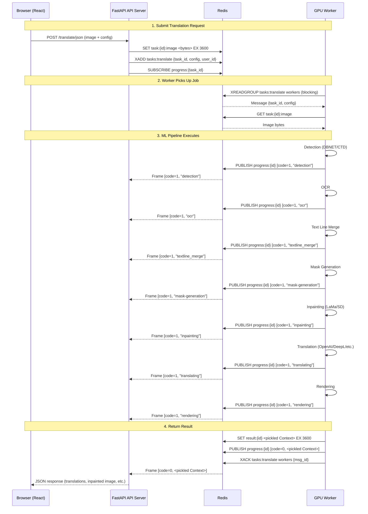
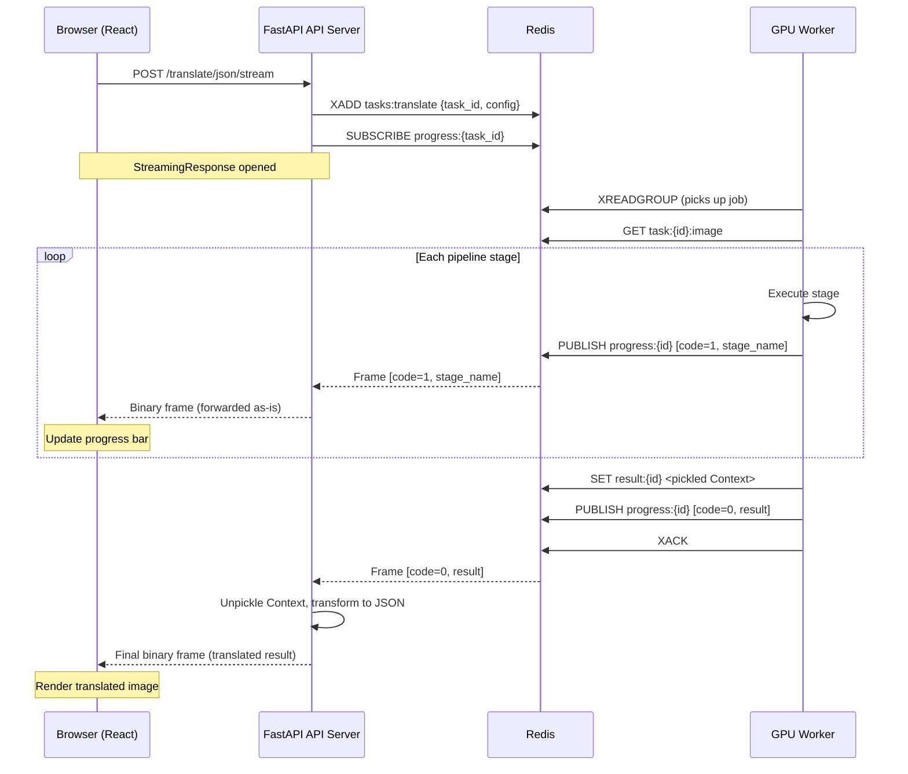
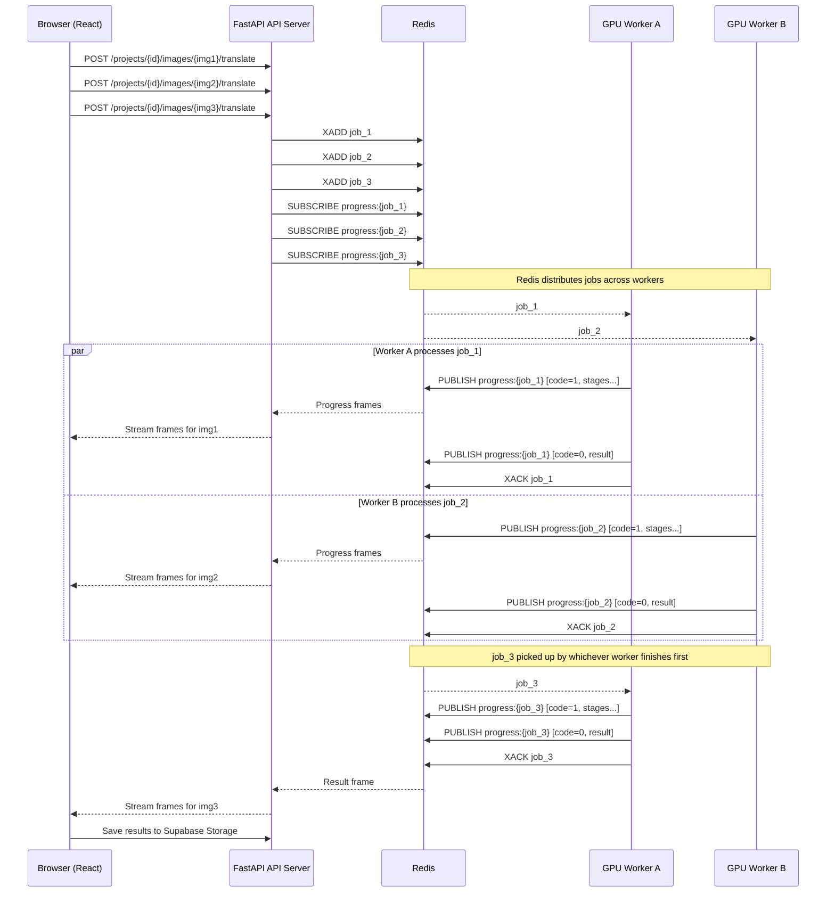
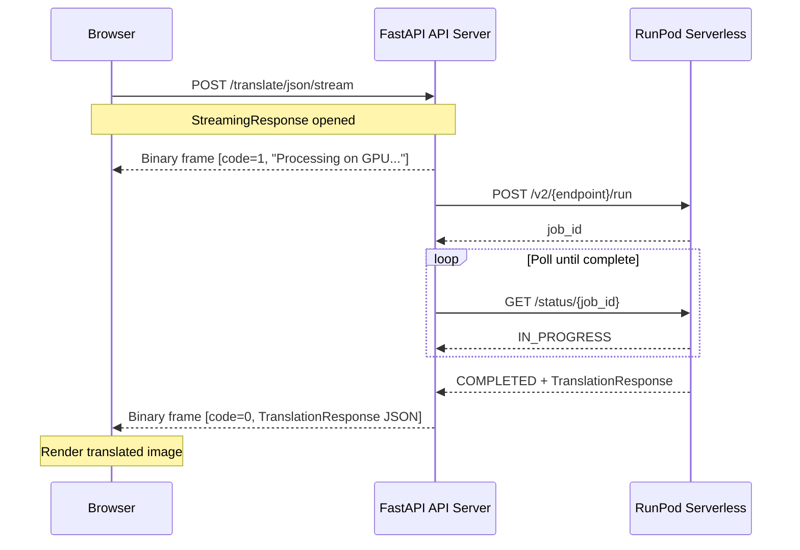
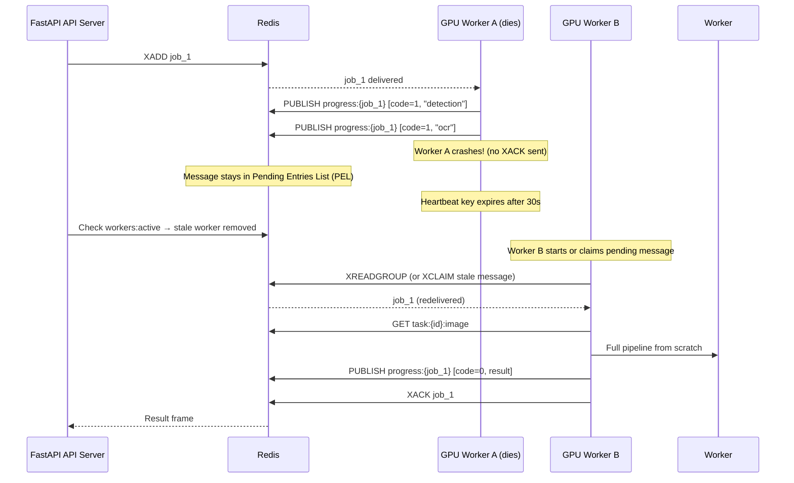

# Translation Task Flow

Sequence diagram showing how a single image translation request is processed end-to-end.

---

## Single Image Translation



---

## Streaming Translation

When the client uses a streaming endpoint, progress frames are forwarded in real-time:



---

## Project Image Translation (Batch)

When translating multiple images in a project:



---

## RunPod Serverless Mode

When `WORKER_MODE=runpod`, the API bypasses Redis and talks directly to RunPod's HTTP API. Smart routing on the worker auto-selects the best translator chain.

```mermaid
sequenceDiagram
    participant Client as Browser (React)
    participant API as FastAPI API Server (Contabo)
    participant RunPod as RunPod Serverless API
    participant Worker as GPU Worker (runpod_handler.py)

    Note over Client,Worker: 1. Submit Translation Request

    Client->>API: POST /translate/json { image, config: { target_lang: "THA" } }
    API->>API: Encode image to base64, serialize config to JSON

    Note over Client,Worker: 2. Submit to RunPod

    API->>RunPod: POST /v2/{endpoint}/run { input: { image_b64, config_json } }
    RunPod-->>API: { id: "job_abc123", status: "IN_QUEUE" }

    Note over Client,Worker: 3. RunPod Queues & Dispatches to Worker

    RunPod->>Worker: handler(event) with { image_b64, config_json }

    Note over Worker: 4. Smart Routing

    Worker->>Worker: apply_smart_routing(config)
    Note over Worker: target_lang="THA" → translator_chain="sugoi:ENG;chatgpt:THA"

    Note over Worker: 5. ML Pipeline Executes

    Worker->>Worker: Detection (DBNET/CTD)
    Worker->>Worker: OCR → detects source: JPN
    Worker->>Worker: Text merge + Mask generation
    Worker->>Worker: Inpainting (LaMa)
    Worker->>Worker: Translation: Sugoi JPN→ENG, then ChatGPT ENG→THA
    Worker->>Worker: Rendering (Kanit font for THA)

    Worker-->>RunPod: TranslationResponse JSON

    Note over Client,Worker: 6. API Polls for Result

    loop Exponential backoff (1s → 5s max)
        API->>RunPod: GET /v2/{endpoint}/status/job_abc123
        RunPod-->>API: { status: "IN_PROGRESS" }
    end

    API->>RunPod: GET /v2/{endpoint}/status/job_abc123
    RunPod-->>API: { status: "COMPLETED", output: TranslationResponse }

    Note over Client,Worker: 7. Return to Client

    API-->>Client: JSON response (translations, inpainted image)
```

### RunPod Streaming Mode

No real-time progress is available from RunPod. The API sends a placeholder frame while polling:



---

## Worker Failure & Recovery



---

## Binary Frame Format

```
┌──────────────┬────────────────────┬──────────────────────┐
│   1 byte     │     4 bytes        │     N bytes          │
│ status code  │ payload length     │ payload              │
│              │ (big-endian)       │                      │
├──────────────┼────────────────────┼──────────────────────┤
│ 0 = result   │                    │ Pickled Context      │
│ 1 = progress │                    │ "detection", "ocr"…  │
│ 2 = error    │                    │ Error message string │
│ 3 = queue    │                    │ Position number      │
│ 4 = waiting  │                    │ (empty)              │
└──────────────┴────────────────────┴──────────────────────┘
```
